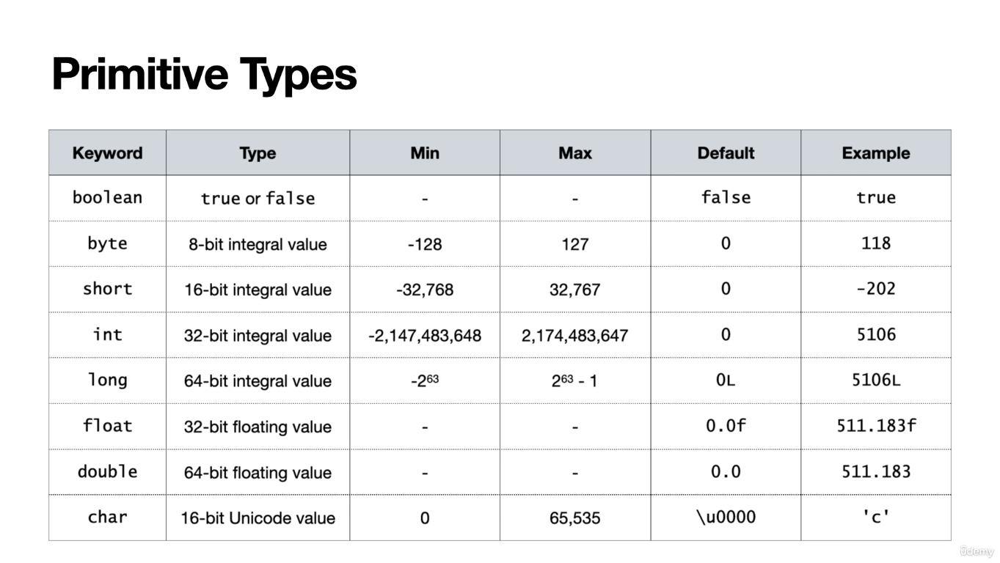

## Classes
–	Classes are basic building block of every java program
–	To design a class means to describe parts and characteristics of these blocks
–	In order to use a class you need to create a object (most of the times)
o	You can think about a clkass as a blueprint, and an object as realization
–	An obj is a single representation of the class, also called instances of class
–	A reference is a varuable that points to a obj
## Fields and Methods
–	Two main elements (members) of Java classes are fields and methods
–	Fields are sometimes referred to variables
o	To be precise: all fields are variables, but not all varaiable are fields
–	Fields hold the info about the state of an object or class
–	Methods describe some action or operation on that state
o	Methods are similar to function in some older programming languages
```java

class Student { }
// in file Student.java
public class Students {
   String name;
   public String getName(){
        return name;
   }
}
```

## Keep in mind
- In Java, boolean true and false are completely different from 1 and 0
- all numeric types are signed 
- float requires an f or F suffix
```java
float x = 1.0; //Does not compile
float x = 1.0f; //compile
```
- double requires a d or D suffix
- long requires an l or L suffix

```java
long a = 1987456293645; // does not compile
long a = 1987456293645L; //compile
```
### Support digital format
- base 10 (digits 0-9) "normal" number
- octal (digits 0-7), uses 0 as a prefix (eg 017)
- hexadecimal (digits 0-9 and A-F), uses 0x or 0X as a prefix (eg 0x1A)
- binary (digits 0-1), uses 0b or 0B as a prefix (eg 0b101010)

>  for readability, you can use underscores in numeric literals (ALLOWED)
>  but not in the beginning or end of the number
```java
int a = 1_000_000; // compile
int b = 1_2; // compile, but not recommended
int b1 = 1_____________________2; // compile, but not recommended
int c = 1_000_000_; // does not compile
int d = _1_000_000; // does not compile

double e = 1_000_000.0; // compile
double f = 1_000_000.0_0; // compile
double g = 1_000_000.0_0_0; // compile
double h = 1_000_000.0_0_0_; // does not compile
double i = 1_000_000_.0; // does not compile
double j = 1_000_000_._0; // does not compile
```

### Support character format
- char is a single 16-bit Unicode character
- char is enclosed in single quotes (eg 'a')
- char can be represented by a number (eg 97) or an escape sequence (eg '\u0061')
- char can be represented by a character literal (eg 'a')

### Wrapper classes
- primitive are not objects, and sometimes we prefer to work with objects
- each primitive has a wrapper class
  - an object type which corresponds to the primitive
- most common way to create an object from the primitive is to use the constructor of the wrapper class
  - use static method valueOf()
```java
// className Integer
Integer a = Integer.valueOf(5); // compile
```


### Identifier Rules
- Must beging with a letter, underscore, or dollar sign
- Can contain letters, digits, underscores, or dollar signs
- Single underscore (_) is not allowed as an identifier
- Cannot be a keyword or reserved word

Example
```java
int a = 5; // compile
int 5a = 5; // does not compile
int a_5 = 5; // compile
int a$5 = 5; // compile
int a 5 = 5; // does not compile
int a 5$ = 5; // does not compile
int a 5_ = 5; // does not compile
int a 5_6 = 5; // does not compile

// variables accepted

$myVAR12
_$myVAR12_
__SomeName1$_
BIG_NAME
_12x
// variables not accepted
```


### Naming Conventions
- Class names should be nouns, in mixed case with the first letter of each internal word capitalized
- Method names should be verbs, in mixed case with the first letter of each internal word capitalized
- Variable names should be in mixed case with a lowercase first letter and the first letter of each internal word capitalized
- Constants should be all uppercase with words separated by underscores
- Package names should be all lowercase
- Use meaningful names

### Variables declared and/or initialized
- in a single line (bad practice, but it compiles)
```java

int x,y;

String firstName = "John", lastName = "Doe";;
boolean v=true, w, z=false;//only w is not initialized is only declared
```

### Three kind of variables
- local variables
  - declared inside a method, constructor, or block
  - only visible within that method, constructor, or block
  - must be initialized before use
  
example
```java
//local variable must be initialized before use
public class Test {
    
    public static void main(String[] args) {
        int x; // local variable
        System.out.println(x); // does not compile, x is not initialized
    }
    
    public int doesCompile(){
        int y = 5; // local variable
        System.out.println(y); // compile, y is initialized
        return y;
    }
    
}

// be careful if initializing in within if-statement

    
    public void doesNotCompili(boolean isOk) {
        int x; // local variable
        if (isOk) {
            x = 5; // might never compile
        }
        System.out.println(x); // compile, x is initialized
    }
    

```
- instance variables
  - declared inside a class, but outside any method, constructor, or block
  - visible to all methods, constructors, and blocks in the class
  - initialized when the class is instantiated
- class variables
  - declared with the static keyword
  - declared inside a class, but outside any method, constructor, or block
  - visible to all methods, constructors, and blocks in the class
  - initialized when the class is loaded
> instance and class variables dont require initialization, assume the default values of their type